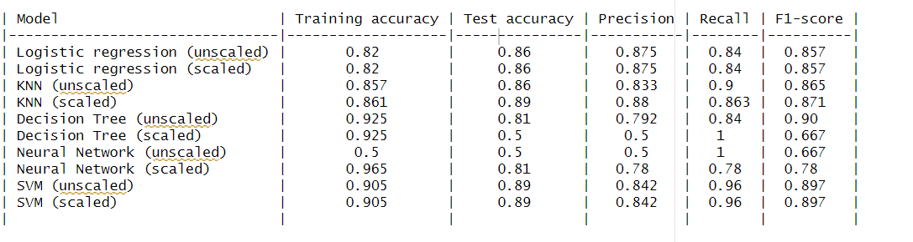

# Predicting Machine Failure Using R (on R-Markdown Document)

A binary classification project to predict failure or non-failure of a machine using different machine learning techniques and evaluating the metrics of accuracy, precision, recall, F1_Score for each model for each technique. The data is a balanced dataset (equal number of failures and non failures) of 500 machines. The data is scaled to improve model performance, thereby providing us with two categories of the data - the scaled dataset and the unscaled dataset. For each category, the data is split into 80% training and 20% test set set, and the following models are trained and performace evaluated.

- A Logistic Regression model
- K-Nearest Neighbors
- Decision Tree
- Neural Network
- Support Vector Machine

The following tables summarizes the result obtained. 

